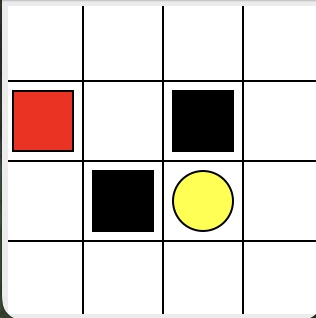

# Reinforcement-Learning

This is used to record learning Reinforcement learning, reference code:
1. https://github.com/MorvanZhou/Reinforcement-learning-with-tensorflow

## Content
### 1. Q-learning  (off-policy)
#### 1.1 Treasure_on_right
`---o---T`  
**state**: -; o (current state)    
**action**: left; right  
**T**: target  
**environment reward**: target=1; others=0  
#### 1.2 Maze
  
**action**: up; down; right; left   
**Red rectangle**: explorer  
**Black rectangles**: hells&nbsp;&nbsp;[reward = -1].      
**Yellow bin circle**: paradise&nbsp;&nbsp;[reward = +1].      
**All other states**: ground&nbsp;&nbsp;[reward = 0].  

### 2. Sarsa (on-policy)
### 3. Sarsa-lambda (on-policy)
### 4. Deep Q Network (off-policy)
Q-learning + Neural network  
#### advantages:
Q-table usually can only store very limited states, and searching through the form is very time consuming. But using deep Q network, it can be a good way to alleviate these problems.  
  
s -> NN -> actions value  
#### Key points:  
(1) Experience replay  
(2) Fixed Q-targets  
#### Steps:
`env`:   
tensorflow 1.15.0  
python 3.7  
`code`:  
(1) conda create -n RL_tensorflow python=3.7  
(2) conda activate RL_tensorflow (windows) / source activate RL_tensorflow (Linux/macOS)
(3) pip install tensorflow==1.15